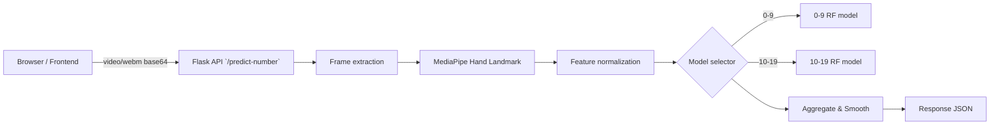

# 🎯 Sri Lankan Sign Language — Number Gestures Recognition

A playful, accessible web app that recognizes Sri Lankan Sign Language (SLSL) number gestures (0–50) via webcam and turns recognition into arithmetic practice for learners.


Badges

- Build: 
- Python: 
- License: 

Why this project

- Bridges accessibility and education — teaches numbers and arithmetic using natural sign language input.
- Designed for classrooms and home practice — kid-friendly UI and localized Sinhala support.

Quick jump

- App entry (frontend): `frontend/`
- API entry (backend): `backend/run.py`
- Models: `models/` (joblib files for number ranges)
- Developer doc: `docs/DETAILED_README.md`

**Highlights**

- Instant number recognition for 0–50 using webcam
- Interactive arithmetic activities (addition, subtraction, multiplication, division)
- Per-attempt feedback and activity reports (stored client-side)
- Sinhala and English localization
- Small footprint inference (scikit-learn RandomForest models)

Live demo (local)

1. Start backend (PowerShell):

```powershell
cd backend
python -m venv .venv
.\.venv\Scripts\Activate.ps1
pip install -r requirements.txt
python run.py
```

2. Start frontend:

```bash
cd frontend
npm install
npm run dev
```

Open the Vite URL (usually `http://localhost:5173`) and allow the camera.

**Creative UX ideas included in the app**

- Kid Mode: colorful cards, friendly sounds, animation on correct answers
- Recording overlay shows processing state (analyzing / confident / retry)
- Activity report with point totals and history chart

Architecture (overview)




## Backend API

This project provides a small REST API implemented with Flask. Primary endpoints below — check the route files under `backend/routes/` for exact implementations and any optional query parameters.

- GET `/health`
  - Purpose: quick liveness check for orchestration and local dev.
  - Response: `{ "status": "ok" }`

- POST `/predict-number`
  - Purpose: receive a recorded gesture (video) and return a predicted number with confidence and model info.
  - Request body: JSON with `video` (data URL `data:video/webm;base64,...`) and optional `sample_rate` (frames/sec to sample).
  - Response example:

```json
{
  "predicted_number": 17,
  "model_key": "10-19",
  "confidence": 0.92,
  "frame_count": 18
}
```

- POST `/activity/generate-question`
  - Purpose: create an arithmetic question for practice.
  - Request body: `{ "operation": "addition" }` (operations: `addition`, `subtraction`, `multiplication`, `division`).

- POST `/activity/validate-answer`
  - Purpose: validate a submitted (predicted) answer for an activity question.
  - Request body: `{ "operation": "addition", "left": 7, "right": 3, "predicted_number": 10 }`
  - Response includes correctness, expected and predicted answers, and optional points awarded.

## Models & How They Work

- Location: `models/` — five `joblib` files covering contiguous numeric ranges (0–9, 10–19, ... 40–50).
- Input: flattened feature vectors derived from MediaPipe hand landmarks per frame; features include normalized (x,y,z) coordinates and engineered angle/distance features.
- Inference strategy: per-frame predictions are made, then aggregated (temporal smoothing / majority vote) to yield the final number and confidence. Model selection uses filename heuristics and internal routing in `backend/utils/inference_engine.py`.

## Tech Stack

- Frontend: React (JSX), Vite dev server, Tailwind CSS for styles.
- Backend: Flask with CORS enabled for local development.
- Vision & features: OpenCV for video/frame handling, MediaPipe for hand landmark detection.
- Models: scikit-learn RandomForest saved with Joblib; NumPy / Pandas used for data handling.

## Project Structure

Top-level layout and responsibilities:

- `backend/` — Flask app, routes, and utilities (inference and activity engines).
- `frontend/` — Vite + React application, components, styles, and i18n resources.
- `models/` — trained model artifacts (`.joblib`).
- `docs/` — developer documentation and detailed notes.

Example important files:

- `backend/run.py` — server entrypoint
- `backend/app.py` — app & blueprint registration
- `backend/routes/prediction_routes.py` — prediction endpoint
- `backend/utils/inference_engine.py` — preprocessing + model orchestration
- `frontend/src/components/WebcamRecorder.jsx` — camera capture & recording
- `frontend/src/services/api.js` — API wrapper and base URL

## Folder & file structure

A detailed tree of the repository (top-level files and important folders):

```
Sri-Lankan-Sign-Language-Number-Gestures-Recognition-Final-Year-Research/
├─ backend/
│  ├─ run.py
│  ├─ app.py
│  ├─ requirements.txt
│  ├─ routes/
│  │  ├─ __init__.py
│  │  ├─ prediction_routes.py
│  │  └─ activity_routes.py
│  └─ utils/
│     ├─ __init__.py
│     ├─ inference_engine.py
│     └─ activity_engine.py
├─ frontend/
│  ├─ index.html
│  ├─ package.json
│  ├─ vite.config.js
│  └─ src/
│     ├─ main.jsx
│     ├─ App.jsx
│     ├─ styles.css
│     ├─ components/
│     │  ├─ WebcamRecorder.jsx
│     │  └─ LanguageSelector.jsx
│     ├─ pages/
│     │  ├─ NumberIdentificationPage.jsx
│     │  ├─ ActivitiesPage.jsx
│     │  └─ ActivityReportPage.jsx
│     ├─ services/
│     │  └─ api.js
│     └─ i18n/
│        ├─ index.jsx
│        ├─ en.json
│        └─ si.json
├─ models/
│  ├─ 0-9_numbers_rf_model.joblib
│  ├─ 10-19_numbers_rf_model.joblib
│  ├─ 20-29_numbers_rf_model.joblib
│  ├─ 30-39_numbers_rf_model.joblib
│  └─ 40-50_numbers_rf_model.joblib
├─ docs/
│  └─ DETAILED_README.md
├─ README.md
└─ LICENSE
```

Key file purposes:

- `backend/run.py`: starts the Flask server (dev mode).
- `backend/routes/prediction_routes.py`: receives `video` payloads and returns predictions.
- `backend/utils/inference_engine.py`: frame extraction, MediaPipe landmarks, feature normalization, model loading and prediction aggregation.
- `backend/utils/activity_engine.py`: arithmetic question generation and validation logic.
- `frontend/src/components/WebcamRecorder.jsx`: handles getUserMedia, recording, and sending video to API.
- `frontend/src/services/api.js`: central API wrapper and base URL configuration.


## Repository Map

This repository maps responsibilities so contributors know where to look:

- backend/: API, inference, activity logic, model-loading — focused on server-side processing.
- frontend/: UI, camera handling, localization, activity UX — responsible for reporting and local storage of attempts.
- models/: trained artifacts that the backend expects by filename.
- docs/: detailed design notes and development guidance.

## Prerequisites

- Python 3.9 or newer (recommended: 3.10+)
- Node.js 18+ and npm (or yarn)
- A webcam and a modern browser (Chrome, Edge, Firefox) with camera support on localhost
- Optional: `ffmpeg` (if you need to inspect or re-encode sample videos)

## Setup

1) Backend (PowerShell / Windows example)

```powershell
cd backend
python -m venv .venv
.\.venv\Scripts\Activate.ps1
pip install -r requirements.txt
python run.py
```

2) Frontend

```bash
cd frontend
npm install
npm run dev
```

3) Configuration

- API base URL is configured in `frontend/src/services/api.js`; change it if your backend runs on a different host or port.

## Notes

- Models: keep the `models/` directory intact; `inference_engine` loads models by expected filenames.
- Camera access: browsers allow camera only on `localhost` or secure contexts (HTTPS).
- Activity persistence: activity attempts are stored client-side (localStorage) for privacy and simplicity.

## Troubleshooting

- Camera doesn't start: check browser permission prompt and close other apps using the camera.
- MediaPipe not detecting hand: ensure good lighting, remove background clutter, and hold the hand steady for a second.
- Prediction output is inconsistent: increase `sample_rate` when sending videos, or record a slightly longer clip. Also verify backend logs for `inference_engine` warnings.
- CORS errors: ensure backend is running and `Flask-CORS` is enabled; check console for the failing endpoint URL.


Roadmap (ideas)

- Add continuous-learning mode (user feedback loop to improve models)
- Replace RF with a temporal deep model (1D-CNN / LSTM) for sequence modeling
- Add server-side attempt storage and user accounts for long-term tracking

Contributing

1. Fork, branch, and open a PR.
2. Keep changes focused; add tests for backend logic when possible.
3. Update `docs/DETAILED_README.md` if you change the inference pipeline.

License & credits

- MIT License — see `LICENSE`.
- Author: Sachinda Bandara — contact via repository issues.

Need more? I can:

- Add a production-ready `Dockerfile` and `docker-compose.yml` to run backend+frontend.
- Create a small test video payload and a `tests/` integration script to validate predictions.

Tell me which next step you'd like and I'll implement it.
