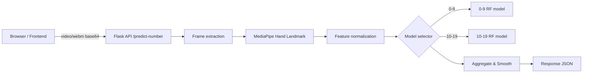

# Sri Lankan Sign Language — Number Gestures Recognition

A web app that recognizes Sri Lankan Sign Language (SLSL) number gestures (0–50) via webcam and turns recognition into interactive arithmetic practice for learners.


---

## Why This Project

- **Bridges accessibility and education** — teaches numbers and arithmetic through natural sign language input.
- **Designed for classrooms and home practice** — kid-friendly UI with Sinhala and English localization.

---

## Highlights

- Real-time number recognition for 0–50 using a webcam
- Interactive arithmetic activities (addition, subtraction, multiplication, division)
- Per-attempt feedback and session reports stored client-side
- Sinhala and English (i18n) support
- Lightweight inference using scikit-learn RandomForest models

---

## Quick Start

### 1. Backend (PowerShell / Windows)

```powershell
cd backend
python -m venv .venv
.\.venv\Scripts\Activate.ps1
pip install -r requirements.txt
python run.py
```

### 2. Frontend

```bash
cd frontend
npm install
npm run dev
```

Open the Vite URL (usually `http://localhost:5173`) and allow camera access when prompted.

---

## Architecture



---

## API Reference

### `GET /health`

Liveness check.

```json
{ "status": "ok" }
```

---

### `POST /predict-number`

Submit a recorded gesture video and receive a predicted number.

**Request body:**

```json
{
  "video": "data:video/webm;base64,...",
  "sample_rate": 5
}
```

**Response:**

```json
{
  "predicted_number": 17,
  "model_key": "10-19",
  "confidence": 0.92,
  "frame_count": 18
}
```

---

### `POST /activity/generate-question`

Generate an arithmetic question for practice.

**Request body:**

```json
{ "operation": "addition" }
```

Supported operations: `addition`, `subtraction`, `multiplication`, `division`.

---

### `POST /activity/validate-answer`

Validate a predicted answer against a generated question.

**Request body:**

```json
{
  "operation": "addition",
  "left": 7,
  "right": 3,
  "predicted_number": 10
}
```

Response includes correctness, expected vs. predicted values, and points awarded.

---

## Models

Five RandomForest models cover contiguous numeric ranges:

| File | Range |
|---|---|
| `0-9_numbers_rf_model.joblib` | 0 – 9 |
| `10-19_numbers_rf_model.joblib` | 10 – 19 |
| `20-29_numbers_rf_model.joblib` | 20 – 29 |
| `30-39_numbers_rf_model.joblib` | 30 – 39 |
| `40-50_numbers_rf_model.joblib` | 40 – 50 |

Each model receives flattened feature vectors derived from MediaPipe hand landmarks per frame. Per-frame predictions are aggregated via temporal smoothing / majority vote to yield the final prediction and confidence score.

---

## Tech Stack

| Layer | Technologies |
|---|---|
| Frontend | React (JSX), Vite, Tailwind CSS |
| Backend | Flask, Flask-CORS |
| Vision | OpenCV, MediaPipe |
| Models | scikit-learn RandomForest, Joblib, NumPy, Pandas |

---

## Project Structure

```
Sri-Lankan-Sign-Language-Number-Gestures-Recognition-Final-Year-Research/
├─ backend/
│  ├─ run.py                        # Server entrypoint
│  ├─ app.py                        # App & blueprint registration
│  ├─ requirements.txt
│  ├─ routes/
│  │  ├─ prediction_routes.py       # /predict-number endpoint
│  │  └─ activity_routes.py         # /activity endpoints
│  └─ utils/
│     ├─ inference_engine.py        # Frame extraction, landmarks, model orchestration
│     └─ activity_engine.py         # Question generation and validation logic
├─ frontend/
│  ├─ index.html
│  ├─ package.json
│  ├─ vite.config.js
│  └─ src/
│     ├─ App.jsx
│     ├─ components/
│     │  ├─ WebcamRecorder.jsx      # Camera capture & recording
│     │  └─ LanguageSelector.jsx
│     ├─ pages/
│     │  ├─ NumberIdentificationPage.jsx
│     │  ├─ ActivitiesPage.jsx
│     │  └─ ActivityReportPage.jsx
│     ├─ services/
│     │  └─ api.js                  # API wrapper and base URL
│     └─ i18n/
│        ├─ en.json
│        └─ si.json
├─ models/                          # Trained .joblib artifacts
├─ docs/
│  └─ DETAILED_README.md
├─ README.md
└─ LICENSE
```

---

## Prerequisites

- Python 3.9+ (3.10+ recommended)
- Node.js 18+ and npm (or yarn)
- A webcam and a modern browser (Chrome, Edge, or Firefox) with camera access on `localhost`
- Optional: `ffmpeg` for inspecting or re-encoding sample videos

---

## Configuration

The API base URL is set in `frontend/src/services/api.js`. Update it if your backend runs on a different host or port.

---

## Troubleshooting

**Camera doesn't start** — check the browser permission prompt and ensure no other application is using the camera.

**MediaPipe not detecting a hand** — ensure good lighting, reduce background clutter, and hold the hand steady for at least one second.

**Inconsistent predictions** — increase `sample_rate` in the request, record a slightly longer clip, or check backend logs for warnings from `inference_engine`.

**CORS errors** — confirm the backend is running and Flask-CORS is enabled; check the browser console for the failing endpoint URL.

---

## License

MIT License — see [LICENSE](LICENSE) for details.

**Author:** Sachinda Bandara — contact via repository issues.